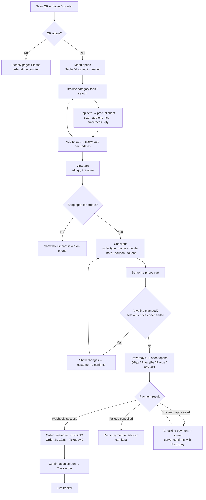
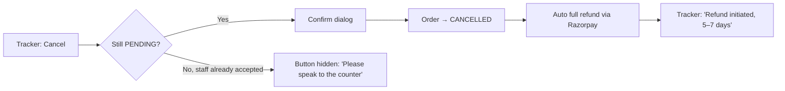
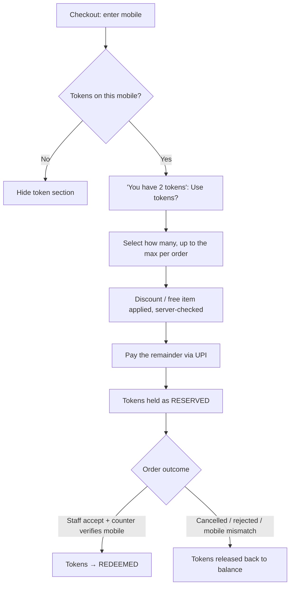
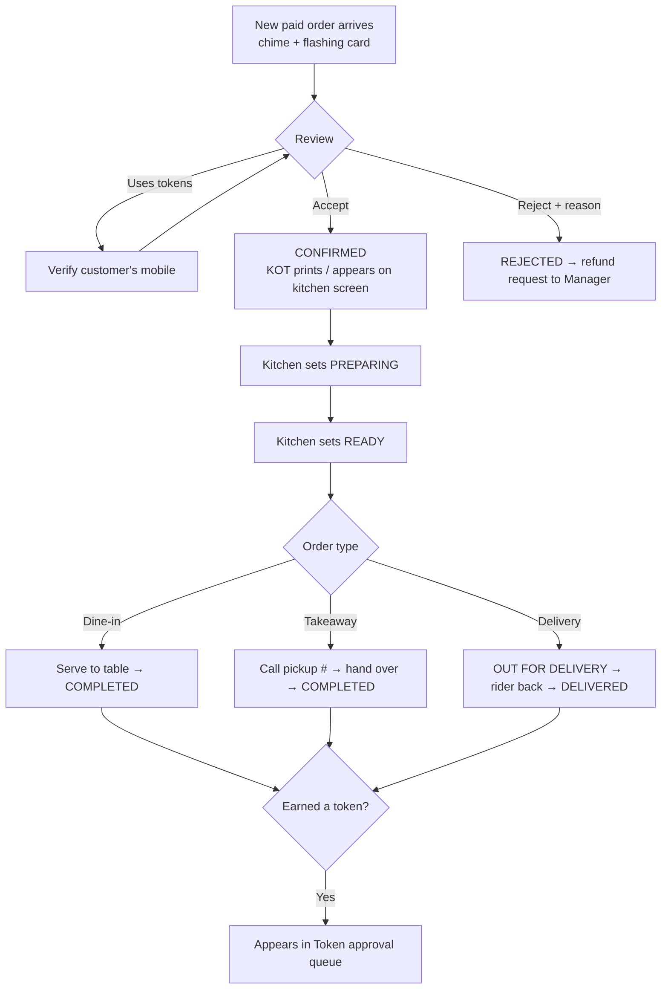
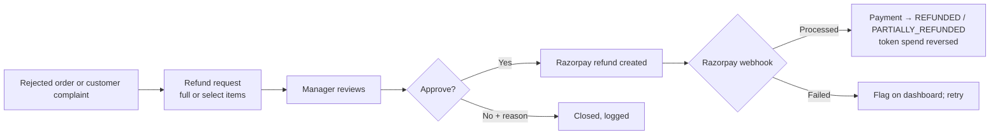
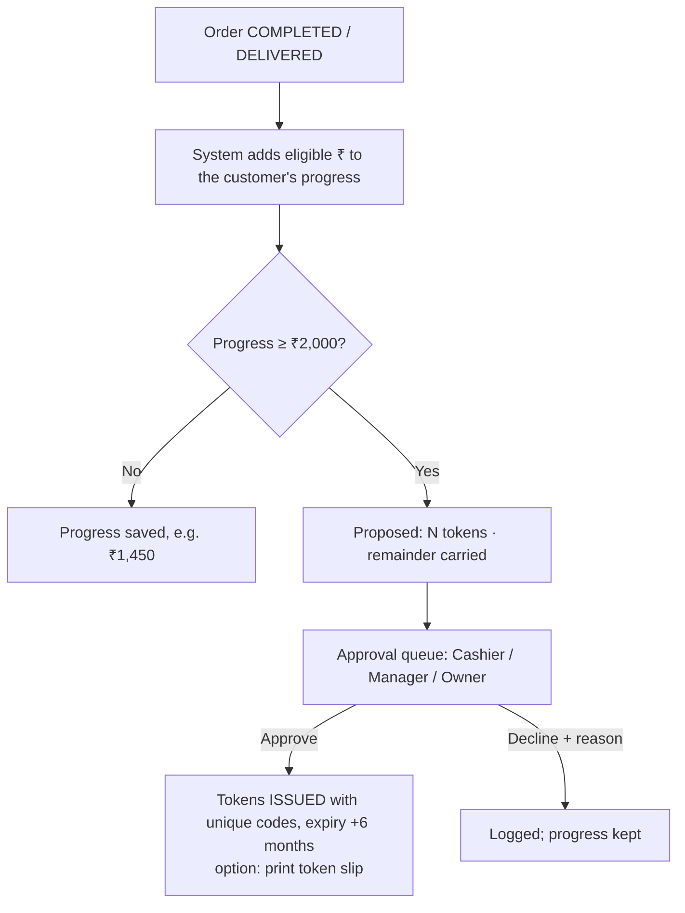
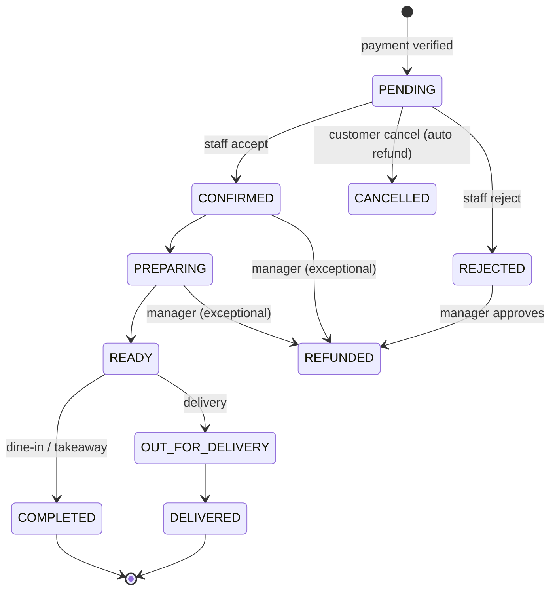

# The Slush Bar — Phase 2: User Flows

**Status:** ✅ Approved by owner 2026-09-21 · **Date:** 2026-09-21 · Builds on [Phase 1](PHASE-1-REQUIREMENTS.md) (FR-numbers refer to it)

> **Amended 2026-09-22 — the token scheme changed.** On the owner's instruction, redeemable reward
> tokens were replaced by the **Lucky Draw**: a mobile number's spending (excluding GST) adds up across
> every order, and at ₹2,000 it earns **one** numbered token (`SLB-001`…`SLB-500`) that is a draw entry,
> never spent. Anything below about earning, approving, redeeming, expiring or owing tokens is
> **superseded** by “Lucky Draw tokens” in [REQUIREMENTS.md](REQUIREMENTS.md); the rest of this
> document still stands. What was actually built is in
> [IMPLEMENTATION-NOTES.md](IMPLEMENTATION-NOTES.md).


Diagrams are in Mermaid; they render on GitHub and in VS Code with a Mermaid preview.

---

## 1. Customer flows

### 1.1 Main path: scan → order → pay → track



**Key rules on this path**
- The table number comes from the QR code only. On a table QR the customer can't change it, but can switch to Takeaway.
- The cart is saved on the phone, so a refresh or a closed tab doesn't lose it.
- The order exists in the kitchen **only after the webhook confirms payment** (FR-16). Before that it's just an internal "payment attempt".
- One payment attempt = one order, however many times the page is refreshed or retried (FR-18).

### 1.2 Checkout by order type

| Step | Dine-in (table QR) | Takeaway (counter QR or chosen) | Delivery |
|---|---|---|---|
| Table | Auto from QR, locked | — | — |
| Name + mobile | Required | Required | Required |
| Address | — | — | Address text + map pin (must be inside the radius) |
| Fees | — | — | Delivery fee (flat) |
| Minimum order | — | — | Delivery minimum |
| Final hand-off | Staff serve to table | Pickup # called at counter | Rider: Out for delivery → Delivered |

### 1.3 Live order tracker

```
Order SL-1025          Pickup #42
Payment ✓ Paid (UPI)
✓ Order received      (Pending: waiting for the shop to accept)
✓ Accepted            (Confirmed)
→ Preparing           ETA ~8 min
○ Ready               "Collect at counter" / "Coming to Table 04"
○ Completed

[Cancel order]  ← visible only while Pending
[Download receipt]  [Order again]
Token progress: ₹1,450 / ₹2,000 → 1 token
```
- Updates live; the customer doesn't refresh.
- If the order is **rejected**: "Sorry, the shop couldn't take this order. Your refund is being processed."
- **Lost link:** on the menu, "Track my order" → enter mobile + order number → the tracker opens (FR-25).

### 1.4 Customer cancels (FR-21)


### 1.5 Customer redeems tokens (FR-13, FR-31, FR-34)

*Superseded by the Lucky Draw — see the amendment note at the top of this document.*


- **Launch rule:** because there's no OTP yet, staff check the customer's phone number **before accepting** any order that uses tokens. The order card shows a "Verify mobile" badge.
- If the whole order is covered by tokens (₹0 to pay), it skips Razorpay and goes straight to Pending with the same verification step.

---

## 2. Staff flows

### 2.1 Login
```mermaid
flowchart TD
  A[/admin] --> B{Who?}
  B -- Owner / Manager --> C[Email + password] --> D{Owner?}
  D -- Yes --> E[2FA code from an authenticator app] --> F[Dashboard]
  D -- No, Manager --> F
  B -- Counter / Kitchen device --> G[Device already registered by the Owner]
  G --> H[Pick your name → 4-digit PIN]
  H --> I{Role}
  I -- Cashier --> J[Live Orders board]
  I -- Kitchen --> K[Kitchen screen]
```
- **Shop devices** are registered once by the Owner. A PIN works **only on a registered device**, so a leaked PIN is useless from home.
- Automatic lock after X minutes idle; switching staff = tap your name + PIN. Every action is recorded against the person who did it.
- 5 wrong PINs lock that staff account for 15 minutes.

### 2.2 Counter: live orders board (Cashier)

- **Board layout:** columns New · Confirmed · Preparing · Ready · Out for delivery.
- **Late-order highlight:** an order sitting in New or Confirmed longer than 5 min pulses amber.
- **Always visible on the board:** "Print receipt", "Reprint KOT", "Mark item sold out" (quick 86 button).
- **Can't be skipped:** a status can move forward one step at a time; going back needs a Manager.

### 2.3 Kitchen screen
- Shows only CONFIRMED and PREPARING orders, oldest first: big item names, modifiers highlighted (e.g. **50% sweet**, **+boba**), and the note.
- Two buttons per order: **Start** (→ Preparing) and **Ready** (→ Ready). No prices, no customer phone numbers.
- The chime plays when a new order is accepted.

### 2.4 Refund approval (Manager / Owner) (FR-22)


### 2.5 Token approval & manual actions (FR-29, FR-33)

*Superseded by the Lucky Draw — see the amendment note at the top of this document.*


- Manual adjustments (add/remove tokens or progress) are **Manager and Owner only**, need a reason, and are logged.
- A nightly job marks expired tokens EXPIRED and updates the "tokens expiring soon" figure on the dashboard.

### 2.6 Menu management (Manager / Owner)
```
Menu → Categories (drag to reorder) → Item
  ├─ Name, description, image upload, category
  ├─ Sizes & prices  (Regular ₹149 · Mega ₹189)
  ├─ Add-on groups   (Boba +₹30, Jelly +₹20)
  ├─ Free options    (Ice: Light/Standard/Extra · Sweet: 50/100/120%)
  ├─ Prep time, time window, featured, available / sold out
  └─ Save → live on the customer menu within seconds
```
- A price change over ±50% shows a "Are you sure? ₹149 → ₹14.9?" warning (guards against typos).
- Every price change is audited (old → new, who, when).
- Deleting an item that has past orders **archives** it rather than deleting it, so old receipts stay correct.
- Cashiers get only a quick **Sold out / Back in stock** toggle, not full editing.

### 2.7 QR codes (Owner / Manager)
Create QR (Table 05 or Counter) → preview the branded standee → download PNG/PDF or print → enable/disable → see orders per QR.

### 2.8 Reports & settings (Owner / Manager)
- **Reports:** pick a period → sales, products, categories, hours, payments/refunds, tokens, customers → CSV export.
- **Settings (Owner):** business info & hours, last-order buffer, delivery rules, token rules, receipt text, GST switch, Razorpay test/live, staff & devices.

---

## 3. State machines (the rules the code will enforce)

### 3.1 Order

Partial refunds don't change the order status; they change the **payment** status to PARTIALLY_REFUNDED.

### 3.2 Payment
`CREATED → PENDING → SUCCESSFUL | FAILED`, then `SUCCESSFUL → PARTIALLY_REFUNDED → REFUNDED`.

### 3.3 Token

*Superseded by the Lucky Draw — see the amendment note at the top of this document.*

`ISSUED → RESERVED (in a checkout) → REDEEMED`, `RESERVED → ISSUED` (order cancelled/rejected), `ISSUED → EXPIRED`, `ISSUED/REDEEMED → REVERSED` (refund).

---

## 4. Decisions (all approved 2026-09-21)
1. **Orders only enter the kitchen queue after payment is verified.** Unpaid attempts are never shown to staff.
2. **Shop devices are registered by the Owner**, and staff PINs only work on those devices.
3. **Token orders are verified by staff before accepting:** a "Verify mobile" badge, checked against the customer's phone.
4. **Reserved tokens:** tokens chosen at checkout are held, and released if the order is cancelled or rejected.
5. **Status moves forward one step at a time.** Going back is Manager-only.
6. **The kitchen screen has no prices or customer phone numbers.**
7. **Deleting a menu item with past orders archives it** instead of deleting it.
8. **Price typo guard:** a warning when a price changes by more than ±50%.
9. **Cashier menu access is limited to the Sold-out toggle.**
