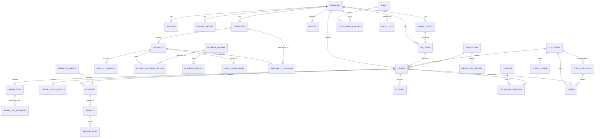

# The Slush Bar — Phase 4: Database Design

**Status:** ✅ Decisions 1–10 approved 2026-09-21 · Revision 2 (§8–§12) approved 2026-09-21 · **Date:** 2026-09-21 · Builds on Phases [1](PHASE-1-REQUIREMENTS.md)–[3](PHASE-3-FEATURE-LIST.md)

> **Amended 2026-09-22 — the token scheme changed.** On the owner's instruction, redeemable reward
> tokens were replaced by the **Lucky Draw**: a mobile number's spending (excluding GST) adds up across
> every order, and at ₹2,000 it earns **one** numbered token (`SLB-001`…`SLB-500`) that is a draw entry,
> never spent. Anything below about earning, approving, redeeming, expiring or owing tokens is
> **superseded** by “Lucky Draw tokens” in [REQUIREMENTS.md](REQUIREMENTS.md); the rest of this
> document still stands. What was actually built is in
> [IMPLEMENTATION-NOTES.md](IMPLEMENTATION-NOTES.md).

**Engine:** PostgreSQL 15+. This design works with any hosted Postgres; the hosting choice is Phase 5.

---

## 0. Design principles
1. **Money is stored as whole paise** (`bigint`). ₹149.00 = `14900`. No decimal rounding errors.
2. **Orders keep snapshots.** An order stores the item name, size, add-ons and prices *as they were*. Later menu edits never change old orders or receipts.
3. **Nothing important is hard-deleted.** Menu items and categories get `archived_at`. Orders, payments, tokens and audit rows are never deleted.
4. **The token ledger is append-only.** Every change to a customer's progress or tokens is a new row. Balances are cached for speed, but can always be rebuilt from the ledger.
5. **Multi-branch ready.** Every shop-owned table has `branch_id`. **Customers and tokens are chain-wide** (see decision 3).
6. **The database itself enforces the rules** (unique keys, checks, status transitions), not just the app code.
7. **Times are stored as `timestamptz`** (UTC). "Business day" and hours are calculated in `Asia/Kolkata`.

---

## 1. ERD (high level)

---

## 2. Tables

Notation: **PK** primary key · **FK** foreign key · **U** unique · **NN** not null. Every table also has `created_at` and, where editable, `updated_at` (both `timestamptz NN default now()`).

### 2.1 Shop & settings

**branches**
| Column | Type | Notes |
|---|---|---|
| id | uuid PK | |
| slug | text U NN | `bahadurgarh-s6` |
| name, address, pincode, phone, email | text | Phone/email can be blank for now |
| lat, lng | numeric(9,6) | Shop location for the delivery radius |
| timezone | text NN | `Asia/Kolkata` |
| is_active | bool NN | |

**settings**: typed key/value, one row per rule
| Column | Type | Notes |
|---|---|---|
| branch_id | uuid FK → branches | PK part 1 |
| key | text | PK part 2; must be one of the known keys (checked by the app and a CHECK list) |
| value | jsonb NN | Validated against the key's schema before saving |
| updated_by | uuid FK → staff | |

Initial keys:
- **Hours & delivery:** `last_order_buffer_min` = 15, `late_order_alert_min` = 5, `delivery_enabled` = false, `delivery_radius_m`, `delivery_fee_paise`, `delivery_min_order_paise`
- **Tokens:** `token_threshold_paise` = 200000, `token_expiry_months` = 6, `token_max_per_order` = 2, `token_redemption_type` (`free_item` | `flat_amount`), `token_redemption_value_paise`
- **Tax & receipts:** `gst_enabled` = false, `gst_rate_bp` (basis points, 500 = 5%), `gst_inclusive`, `gstin`, `legal_name`, `receipt_header`, `receipt_footer`
- **Payments:** `payment_mode` (`test` | `live`), `offers_enabled` = false (soft launch)

**Razorpay keys are *not* stored here.** They live in server environment variables only.

**business_hours**
| Column | Type | Notes |
|---|---|---|
| id | uuid PK | |
| branch_id | uuid FK NN | |
| weekday | smallint NN | 0–6, CHECK |
| opens_at, closes_at | time NN | 11:00 / 23:00 |

**store_closures** (holidays / unexpected closures): `branch_id`, `starts_at`, `ends_at`, `reason`.

### 2.2 Staff, devices, access

**staff**
| Column | Type | Notes |
|---|---|---|
| id | uuid PK | |
| name | text NN | |
| email | citext U | Owner/Manager only |
| password_hash | text | Argon2id; Owner/Manager only |
| totp_secret_enc | text | Encrypted 2FA secret; required for Owner |
| pin_hash | text | Argon2id; Cashier/Kitchen |
| failed_pin_count | smallint NN default 0 | |
| locked_until | timestamptz | 5 wrong PINs → +15 min |
| is_active | bool NN | Deactivate, never delete |

**staff_branch_roles**: `staff_id` FK, `branch_id` FK, `role` enum (`owner`, `manager`, `cashier`, `kitchen`). **PK (staff_id, branch_id).**

**devices** (registered shop tablets/PCs)
| Column | Type | Notes |
|---|---|---|
| id | uuid PK | |
| branch_id | uuid FK NN | |
| name | text NN | "Counter tablet", "Kitchen screen" |
| device_secret_hash | text NN U | The device keeps the raw secret in a secure cookie |
| allowed_roles | role[] NN | e.g. the kitchen screen allows only `kitchen` |
| registered_by | uuid FK → staff | |
| last_seen_at, revoked_at | timestamptz | |

**sessions**: `id`, `staff_id` FK, `device_id` FK (nullable), `token_hash` U, `expires_at`, `revoked_at`, `ip`, `user_agent`.

### 2.3 Tables & QR codes

**dining_tables**: `id`, `branch_id` FK, `label` text (e.g. "04"), `seats`, `is_active`. **U (branch_id, label)**.

**qr_codes**
| Column | Type | Notes |
|---|---|---|
| id | uuid PK | |
| branch_id | uuid FK NN | |
| kind | enum `table` \| `counter` | |
| table_id | uuid FK → dining_tables | CHECK: required if kind = table, empty if counter |
| slug | text U NN | Random, not guessable (e.g. `t/k7Qm2x`), so tables can't be spoofed by typing `/t/05` |
| is_active | bool NN | A disabled QR shows the "order at counter" page |

### 2.4 Menu

**categories**: `id`, `branch_id` FK, `name`, `sort_order` int, `is_active`, `archived_at`. **U (branch_id, name) where not archived.**

**products**
| Column | Type | Notes |
|---|---|---|
| id | uuid PK | |
| branch_id | uuid FK NN | |
| category_id | uuid FK NN | |
| kind | enum `item` \| `combo` | |
| name | text NN | |
| description | text | |
| image_path | text | Path in cloud storage |
| accent_color | text | Optional flavour colour (#00C0F3 …) for cards |
| prep_minutes | smallint NN default 5 | CHECK 0–120 |
| is_featured | bool NN | |
| is_sold_out | bool NN default false | Quick toggle |
| is_active | bool NN | Hidden without archiving |
| sort_order | int NN | |
| archived_at | timestamptz | |

**product_variants** (sizes). **Every product has at least one**; a single-price item has one variant.
| Column | Type | Notes |
|---|---|---|
| id | uuid PK | |
| product_id | uuid FK NN | |
| name | text NN | "Regular 350 ml", "Mega 500 ml" |
| price_paise | bigint NN | CHECK ≥ 0 |
| is_default | bool NN | Exactly one default per product (partial unique index) |
| is_token_redeemable | bool NN default false | e.g. only Regular slushes can be taken for a token |
| sort_order | int | |
| archived_at | timestamptz | |

**modifier_groups** (reusable, e.g. "Toppings" shared by all slushes)
| Column | Type | Notes |
|---|---|---|
| id | uuid PK | |
| branch_id | uuid FK NN | |
| name | text NN | "Ice level", "Sweetness", "Add-ons" |
| kind | enum `paid_addon` \| `free_option` | |
| min_select, max_select | smallint NN | Ice level: 1/1 (required, pick one); Add-ons: 0/3 |

CHECK 0 ≤ min ≤ max.

**modifier_options**: `id`, `group_id` FK, `name`, `price_paise` (CHECK ≥ 0; must be 0 when the group kind is `free_option`), `is_default`, `is_sold_out`, `sort_order`, `archived_at`.

**product_modifier_groups**: `product_id` FK, `group_id` FK, `sort_order`. **PK (product_id, group_id).**

**combo_components**: `combo_product_id` FK, `component_product_id` FK, `component_variant_id` FK (nullable = customer chooses), `qty` (CHECK > 0). CHECK: combo ≠ component.

**availability_windows** (time-based items)
| Column | Type | Notes |
|---|---|---|
| id | uuid PK | |
| category_id / product_id | uuid FK | CHECK: exactly one of the two is set |
| days_mask | smallint NN | Bit per weekday (127 = every day) |
| start_time, end_time | time NN | End < start means it crosses midnight |

### 2.5 Offers

**coupons**
| Column | Type | Notes |
|---|---|---|
| id | uuid PK | |
| branch_id | uuid FK NN | |
| code | citext NN | **U (branch_id, code)**, case-insensitive |
| discount_type | enum `percent` \| `flat` | |
| value | int NN | Percent in basis points (1000 = 10%) or paise |
| min_order_paise, max_discount_paise | bigint | |
| starts_at, ends_at | timestamptz | |
| usage_limit_total, usage_limit_per_customer | int | NULL = unlimited |
| used_count | int NN default 0 | Updated inside the order transaction while the coupon row is locked (FOR UPDATE), so two people can't use the last slot at the same moment |
| is_active | bool NN | |

**coupon_redemptions**: `id`, `coupon_id` FK, `order_id` FK **U**, `customer_id` FK, `discount_paise`. Index (coupon_id, customer_id) for per-customer limits. Released if the payment expires or the order is cancelled.

**promotions** (automatic offers)
| Column | Type | Notes |
|---|---|---|
| id | uuid PK | |
| branch_id | uuid FK NN | |
| kind | enum `happy_hour` \| `first_order` | |
| name | text NN | |
| discount_type, value, max_discount_paise, min_order_paise | | As in coupons |
| days_mask, start_time, end_time | | Happy hour window |
| starts_on, ends_on | date | Campaign dates |
| is_active | bool NN | |

**promotion_targets**: `promotion_id` FK, `category_id` / `product_id` (exactly one). No targets = applies to everything.

### 2.6 Customers

**customers** (chain-wide)
| Column | Type | Notes |
|---|---|---|
| id | uuid PK | |
| mobile | text U NN | Stored as `+91XXXXXXXXXX`, CHECK format |
| name | text | Latest name used |
| first_order_at, last_order_at | timestamptz | First-order offer + repeat rate |
| order_count | int NN default 0 | Cache |
| total_spent_paise | bigint NN default 0 | Cache (net of refunds) |
| token_progress_paise | bigint NN default 0 | Progress toward the next token; CHECK ≥ 0 |
| token_balance | int NN default 0 | Cache: count of ISSUED tokens |
| token_debt | int NN default 0 | Tokens owed after a refund reversal; CHECK ≥ 0 |

### 2.7 Orders

**orders**
| Column | Type | Notes |
|---|---|---|
| id | uuid PK | |
| branch_id | uuid FK NN | |
| public_token | text U NN | Long random string in the tracker link (`/order/{public_token}`); the id is never exposed |
| order_number | text | Given **only when payment succeeds**: `SL-1001`. **U (branch_id, order_number)** |
| pickup_number | smallint | 1–99, resets daily |
| source | enum `qr` (+ `counter` reserved for the future POS) | |
| order_type | enum `dine_in` \| `takeaway` \| `delivery` | |
| status | order_status NN | See 2.7.1 |
| qr_code_id | uuid FK | Which QR the order came from |
| table_id | uuid FK; table_label text | Snapshot |
| customer_id | uuid FK NN | |
| customer_name, customer_mobile | text NN | Snapshots |
| note | text | Max 200 characters, sanitised |
| delivery_address | text | CHECK: required when order_type = delivery |
| delivery_lat, delivery_lng | numeric(9,6) | |
| delivery_distance_m | int | Checked against the radius on the server |
| subtotal_paise | bigint NN | **Menu value** (before any discount) |
| promo_discount_paise | bigint NN default 0 | Happy hour |
| order_discount_paise | bigint NN default 0 | Coupon or first-order |
| token_discount_paise | bigint NN default 0 | |
| delivery_fee_paise | bigint NN default 0 | |
| tax_paise | bigint NN default 0 | 0 while GST is off |
| total_paise | bigint NN | CHECK = subtotal − all discounts + fee + tax, and ≥ 0 |
| token_eligible_paise | bigint NN | Menu value of paid items only (excludes token items and the fee) |
| coupon_id, promotion_id | uuid FK | |
| requires_mobile_check | bool NN | True when tokens are used |
| mobile_checked_by, mobile_checked_at | | Cashier who verified |
| eta_minutes | smallint | |
| reject_reason, cancel_reason | text | |
| paid_at, confirmed_at, preparing_at, ready_at, completed_at, cancelled_at | timestamptz | For prep-time analytics |
| payment_expires_at | timestamptz | 30 min after checkout |
| idempotency_key | text U NN | From the checkout request, so a double tap creates only one order |
| version | int NN | Optimistic locking: two staff tapping at once can't overwrite each other |

**2.7.1 order_status enum**

| Status | Meaning | Who can move it |
|---|---|---|
| `awaiting_payment` | Checkout started. **Hidden from staff.** | → `pending` (webhook), → `payment_expired` (job) |
| `payment_expired` | Never paid; releases tokens and coupon | Final |
| `pending` | Paid, waiting for staff to accept | Staff/customer (see Phase 2) |
| `confirmed`, `preparing`, `ready` | | Staff |
| `out_for_delivery`, `delivered` | Delivery only | Staff |
| `completed` | | Staff |
| `rejected`, `cancelled` | | Staff / customer |
| `refunded` | Fully refunded | System, after the refund webhook |

Allowed moves are listed in an `order_transitions` table, and a **trigger rejects any other move**. So even a bug in the app can't skip a step.

**order_items**
| Column | Type | Notes |
|---|---|---|
| id | uuid PK | |
| order_id | uuid FK NN | |
| product_id, variant_id | uuid FK | |
| product_name, variant_name | text NN | Snapshots |
| unit_price_paise | bigint NN | Menu price of the variant + paid add-ons, at the time of ordering |
| promo_discount_paise | bigint NN default 0 | Happy hour, per unit |
| qty | smallint NN | CHECK 1–50 |
| line_total_paise | bigint NN | |
| is_token_item | bool NN | Paid with a token (price shown as ₹0) |
| prep_minutes | smallint | Snapshot |
| parent_item_id | uuid FK → order_items | Components of a combo point to the combo line |
| refunded_qty | smallint NN default 0 | CHECK ≤ qty |

**order_item_modifiers**: `order_item_id` FK, `modifier_option_id` FK, `group_name`, `option_name`, `price_paise` (all snapshots).

**order_status_events** (the tracker, analytics, and future notifications all read this)
| Column | Type | Notes |
|---|---|---|
| id | bigserial PK | |
| order_id | uuid FK NN | |
| from_status, to_status | order_status | |
| actor_type | enum `customer` \| `staff` \| `system` | |
| staff_id | uuid FK | |
| device_id | uuid FK | |
| reason | text | |

**order_counters**: `branch_id`, `business_date` date, `last_pickup` smallint. PK (branch_id, business_date). **branch_order_seq**: one Postgres sequence per branch for `SL-####`. Both are locked and incremented in the same transaction that marks the order paid.

### 2.8 Payments

**payments**
| Column | Type | Notes |
|---|---|---|
| id | uuid PK | |
| order_id | uuid FK NN | An order may have several *attempts* |
| provider | text NN | `razorpay` |
| provider_order_id | text U NN | Razorpay `order_…` |
| provider_payment_id | text U | Razorpay `pay_…` |
| amount_paise | bigint NN | CHECK > 0; must equal orders.total_paise |
| status | enum `created` \| `pending` \| `successful` \| `failed` \| `partially_refunded` \| `refunded` | |
| method | text | `upi`, … |
| failure_reason | text | |
| captured_at | timestamptz | |
| refunded_paise | bigint NN default 0 | CHECK ≤ amount |

**Partial unique index:** only **one** payment per order can be successful/refunded. A second successful capture for the same order is recorded as a **duplicate** and triggers an automatic refund (decision 8).

**refunds**
| Column | Type | Notes |
|---|---|---|
| id | uuid PK | |
| order_id, payment_id | uuid FK NN | |
| kind | enum `full` \| `partial` | |
| amount_paise | bigint NN | CHECK > 0; the total of all refunds can't exceed the captured amount (checked with rows locked) |
| reason | text NN | |
| status | enum `requested` \| `approved` \| `declined` \| `processing` \| `processed` \| `failed` | |
| requested_by, decided_by | uuid FK → staff | |
| is_automatic | bool NN | Customer cancel / duplicate payment = no approval needed |
| provider_refund_id | text U | |

**refund_items**: `refund_id` FK, `order_item_id` FK, `qty`, `amount_paise`.

**webhook_events** (makes webhooks safe to repeat)
| Column | Type | Notes |
|---|---|---|
| id | bigserial PK | |
| provider | text NN | |
| event_id | text NN | Razorpay `x-razorpay-event-id`; **U (provider, event_id)**, so the same event is processed only once |
| event_type | text NN | `payment.captured`, `refund.processed`, … |
| payload | jsonb NN | Kept for 180 days |
| signature_valid | bool NN | Invalid ones are stored but never acted on |
| processed_at, error | | |

### 2.9 Receipts

**receipts**
| Column | Type | Notes |
|---|---|---|
| id | uuid PK | |
| branch_id | uuid FK NN | |
| order_id | uuid FK **U** NN | One receipt per order |
| receipt_number | text NN | `SLB/2026-27/000001`, **U (branch_id, receipt_number)** |
| financial_year | text NN | Indian financial year (April–March) |
| is_tax_invoice | bool NN | False while GST is off |
| snapshot | jsonb NN | Shop details, line items and totals as printed. Never changes |
| pdf_path | text | Generated on demand, then cached |

**receipt_counters**: `branch_id`, `financial_year`, `last_seq`. Numbers never skip or repeat.

### 2.10 Tokens

*Superseded by the Lucky Draw — see the amendment note at the top of this document.*

**token_issuances** (the approval queue)
| Column | Type | Notes |
|---|---|---|
| id | uuid PK | |
| customer_id | uuid FK NN | |
| proposed_count | smallint NN | CHECK > 0 |
| progress_at_proposal_paise | bigint NN | |
| status | enum `proposed` \| `approved` \| `declined` | |
| decided_by | uuid FK → staff | |
| decided_at | timestamptz | |
| decline_reason | text | |
| trigger_order_id | uuid FK | Order that crossed the threshold |

**Partial unique index:** at most **one `proposed` row per customer**. If another order completes while one is waiting, the same proposal is updated. On approval, the count is recalculated from current progress: `n = floor(progress / threshold)`, then `progress −= n × threshold`.

**tokens**
| Column | Type | Notes |
|---|---|---|
| id | uuid PK | |
| customer_id | uuid FK NN | |
| code | text U NN | Short, human-readable, not guessable, e.g. `SLB-7KQ4-M9XD` (no confusable letters) |
| status | enum `issued` \| `reserved` \| `redeemed` \| `expired` \| `reversed` | |
| issuance_id | uuid FK NN | |
| issued_at, expires_at | timestamptz NN | expires = issued + setting |
| reserved_order_id, redeemed_order_id | uuid FK | |
| redeemed_at, reversed_at | timestamptz | |
| reversal_reason | text | |

Reserving is a single guarded update: `UPDATE tokens SET status='reserved' … WHERE id = ANY($ids) AND status='issued' AND expires_at > now()`. If fewer rows change than requested, the checkout is refused. Two phones can't spend the same token.

**token_ledger** (append-only, never updated or deleted)
| Column | Type | Notes |
|---|---|---|
| id | bigserial PK | |
| customer_id | uuid FK NN | |
| entry_type | enum | `progress_earned`, `progress_reversed`, `tokens_issued`, `debt_settled`, `token_reserved`, `token_released`, `token_redeemed`, `token_expired`, `token_reversed`, `token_debt_added`, `manual_progress_adjust`, `manual_token_adjust` |
| progress_delta_paise | bigint NN default 0 | |
| token_delta | int NN default 0 | |
| progress_after_paise, balance_after, debt_after | | Running totals, for easy auditing |
| order_id, token_id, issuance_id | uuid FK | |
| staff_id | uuid FK | |
| reason | text | CHECK: required for manual entries |

**Refund reversal rule, as stored:** refunding ₹X of eligible value adds a `progress_reversed` row. If that drops progress below 0, earlier tokens are reversed: an unused one first; if none is left, `token_debt` goes up. Newly approved tokens pay off the debt first (`debt_settled`).

### 2.11 Audit

**audit_logs** (append-only; UPDATE/DELETE blocked by a trigger and by permissions)
| Column | Type | Notes |
|---|---|---|
| id | bigserial PK | |
| branch_id | uuid | |
| actor_type | enum `staff` \| `system` | |
| staff_id, device_id | uuid | |
| action | text NN | `product.price_changed`, `refund.approved`, `token.manual_adjust`, `settings.updated`, `staff.pin_reset`, `qr.disabled`, … |
| entity_type, entity_id | text, uuid | |
| before, after | jsonb | |
| reason | text | |
| ip | inet | |

---

## 3. Key indexes
| Table | Index | Serves |
|---|---|---|
| orders | (branch_id, status, paid_at) WHERE status IN (pending … out_for_delivery) | Live board, kitchen screen |
| orders | (branch_id, paid_at DESC) | Order history, reports |
| orders | (customer_id, paid_at DESC) | Customer profile |
| orders | (customer_mobile, order_number) | "Find my order" |
| orders | U public_token · U idempotency_key · U (branch_id, order_number) | Tracker, duplicate prevention |
| orders | (status, payment_expires_at) WHERE status = 'awaiting_payment' | Expiry job |
| order_items | (order_id) · (product_id) | Receipts · product sales report |
| order_status_events | (order_id, id) | Tracker timeline |
| payments | U provider_order_id · U provider_payment_id · (order_id) | Webhook lookup |
| webhook_events | U (provider, event_id) | Idempotency |
| products | (branch_id, category_id, sort_order) WHERE archived_at IS NULL | Menu load |
| product_variants | (product_id) · partial U (product_id) WHERE is_default | |
| coupons | U (branch_id, lower(code)) | Coupon lookup |
| customers | U mobile | Checkout, lookup |
| tokens | U code · (customer_id, status, expires_at) | Redemption, expiry job |
| token_issuances | partial U (customer_id) WHERE status = 'proposed' · (status, created_at) | Approval queue |
| token_ledger | (customer_id, id) | Token history |
| audit_logs | (entity_type, entity_id, id) · (created_at) | Audit screens |

---

## 4. Transactions (all-or-nothing operations)
| Operation | Done as one transaction |
|---|---|
| **Checkout** | Re-price the cart → create an `awaiting_payment` order + items → lock and reserve the coupon slot → reserve tokens → create the Razorpay order → store the payment row |
| **Payment captured (webhook)** | Record the event (skip if seen before) → mark the payment successful → give the order its number and pickup number → order `pending` → status event |
| **Payment expired** (job, every 5 min) | Order `payment_expired` → release tokens and coupon |
| **Accept** | Check `version` → `confirmed` → if tokens were used: must be mobile-checked → tokens `redeemed` |
| **Complete / Delivered** | Status → add eligible ₹ to progress (ledger) → create/update the token proposal |
| **Approve tokens** | Lock customer → n = floor(progress / threshold) → settle debt first → create codes → ledger |
| **Refund processed** (webhook) | Update payment/refund → reverse progress and tokens (ledger) → order `refunded` if full → audit |

---

## 5. Reports
Built as SQL **views** over orders, items, payments and the ledger: daily sales, by product, by category, by hour, payments & refunds, tokens (issued / redeemed / outstanding / expiring in 30 days), and customers (new vs repeat). At this shop's size they'll stay fast; summary tables can be added later if needed.

**Token liability** = outstanding tokens × token value.

## 6. Size estimate
~300 orders/day × 365 ≈ 110k orders/year. With items, events and ledger rows that's roughly **150–250 MB a year**, so it fits in free database tiers for the first year. Images go to object storage, not the database.

---

## 7. Decisions (approved 2026-09-21)
1. **Money stored as whole paise** (no decimals).
2. **Unpaid checkouts are stored as hidden `awaiting_payment` orders** that expire after **30 min**, releasing any reserved tokens or coupon. Order numbers are given **only after payment**, so there are no gaps.
3. **Customers and tokens are chain-wide.** When you open branch #2, a customer's tokens work there too. Menu, orders and reports stay per branch.
4. **Numbering:** orders `SL-1001, SL-1002…` (continuous); pickup number **1–99, resetting daily**; receipts `SLB/2026-27/000001` per financial year (April–March).
5. **Offer stacking:** happy hour (item-level) **can combine** with **one** order-level discount: coupon **or** first-order. If the customer enters a coupon, it replaces the first-order offer. Tokens apply on top. A token-paid item never gets happy-hour pricing.
6. **Token debt:** if a refund reverses a token that was already used, the customer owes 1 token. It's paid off automatically from their next approved token.
7. **Which items tokens can buy** is set per size (e.g. only "Regular" slushes), once you decide the token value.
8. **Duplicate payments** (the customer paid twice for one order) are **refunded automatically, without Manager approval**. They're unambiguous, and it avoids an angry customer.
9. **QR links use random codes** (`/t/k7Qm2x`), not `/t/04`, so nobody can fake another table by editing the link.
10. **Record keeping:** webhook data is kept 180 days; the audit log and token ledger are kept forever.

---

# Revision 2: Optimisation & fraud hardening

> **An honest note:** no system is 100% fraud-proof. The goal is that every fraud path is either **blocked outright**, **needs two people to collude**, or is **caught and flagged automatically** with a permanent, tamper-evident trail. The one weak spot left is §9.4: linking tokens to a mobile without OTP. SMS OTP closes it.

## 8. Threat model: who could cheat, and how it's stopped

### 8.1 Customers
| # | Attack | Defence | Result |
|---|---|---|---|
| C1 | Edits the price/cart in the browser | Server re-prices from the database; the browser's prices are ignored | **Blocked** |
| C2 | Shows a fake payment screenshot / fake "success" page | Only a signed Razorpay webhook or a server-side check can mark an order paid | **Blocked** |
| C3 | Pays less than the order total | Webhook amount + currency must equal `payments.amount_paise` = `orders.total_paise`; a mismatch **holds** the order and flags it | **Blocked** |
| C4 | Replays an old webhook / fakes one | HMAC signature over the raw body (constant-time compare) + unique `event_id` | **Blocked** |
| C5 | Fakes a table by editing the link | Random QR slugs (approved decision 9) | **Blocked** |
| C6 | Guesses token codes | 13-character codes (~60 bits random), usable only by the owning mobile, rate-limited | **Blocked** |
| C7 | Prints a fake token slip | Token QR carries an HMAC signature; the counter scan verifies it with the server | **Blocked** |
| C8 | Spends one token on two phones at once | Guarded single-statement reservation (§2.10) | **Blocked** |
| C9 | Brute-forces coupon codes | 10 attempts / 10 min per device + IP; codes not guessable | **Blocked** |
| C10 | Uses the last coupon slot twice at the same moment | Coupon row locked during checkout | **Blocked** |
| C11 | Snoops on others' orders via "find my order" | Needs mobile **+** order number, rate-limited, shows a masked name/mobile | **Blocked** |
| C12 | Gets a refund after the token was already used | Token reversal + token debt (approved decision 6) | **Blocked** |
| C13 | Bank chargeback / UPI dispute after eating | Dispute webhook → payment `disputed` → progress/tokens reversed, customer **frozen** pending review | **Caught** |
| C14 | Uses new mobile numbers to reuse the first-order offer | Offer checks mobile **and** device id; after payment, the **UPI ID** is checked too. A repeat UPI ID flags the order and blocks further first-order use by that UPI ID | **Caught** (fully blocked once OTP is added) |
| C15 | Earns tokens on someone else's number | See §9.4 | **Caught** (blocked with OTP) |
| C16 | Floods checkout with bot/spam orders | Unpaid orders never reach staff; rate limits per IP/device/mobile; daily cap of orders per mobile | **Blocked** |
| C17 | Fake delivery location | Server computes the distance from the pin; out-of-radius is refused | **Blocked** |

### 8.2 Staff (insider fraud, usually the biggest risk in cafés)
| # | Attack | Defence | Result |
|---|---|---|---|
| S1 | Cashier invents tokens for friends | Cashiers can **only approve proposals created by the system from paid, completed orders**. Creating tokens from nothing = Manager/Owner manual adjustment only, with a reason and a **daily cap**; above the cap needs the Owner | **Blocked** |
| S2 | Refund sent to the staff member's own account | Razorpay refunds **only go back to the original payer's UPI**. Nobody can redirect them | **Blocked** |
| S3 | Staff member requests and approves their own refund | **Maker–checker:** `CHECK (decided_by <> requested_by)`. Refunds above a set amount need the Owner | **Blocked** |
| S4 | Creates a 100%-off coupon and uses it | Coupons above X% off, or with no usage limit, need Owner approval before going live; coupon use is shown per coupon in reports | **Blocked** |
| S5 | Drops a price, orders cheaply, restores the price | Every price change is audited; big drops need Owner approval; a **"price flip"** (change reversed within 24 h with orders placed in between) is flagged to the Owner | **Blocked / Caught** |
| S6 | Hides sales or deletes orders | No deletes; order and receipt numbers have no gaps; a **daily Razorpay reconciliation** matches every rupee captured to an order | **Blocked** |
| S7 | Ticks "mobile verified" without checking | Recorded per staff member; token redemptions per staff shown on the Risk screen; unusual patterns flagged | **Caught** |
| S8 | Uses a colleague's PIN | PINs only work on registered devices; each PIN is unique, and weak PINs (1234, 0000, 1111, birth years) are refused; PIN changes are audited | **Deterred + traceable** |
| S9 | Edits the audit log or token history | App database user has **no UPDATE/DELETE** rights on them, a trigger blocks changes, **and** each row carries a hash of the previous row, so any tampering breaks the chain and is detected | **Blocked + tamper-evident** |
| S10 | Owner account stolen | 2FA, session limits, a new-device warning on the Owner dashboard, all sensitive actions logged | **Blocked** |

### 8.3 Payment/system failures that look like fraud
| # | Case | Handling |
|---|---|---|
| P1 | Customer pays but the webhook never arrives | The **reconciliation job** (every 10 min for the last 2 h + a nightly full-day run) asks Razorpay directly and completes the order |
| P2 | Payment arrives **after** the 30-min expiry | The order is **revived** to `pending` with a "Late payment" badge. If its reserved tokens/coupon can't be re-taken, it's flagged for a Manager (accept at the paid amount, or refund) |
| P3 | Customer pays twice | Automatic refund of the duplicate (approved decision 8) |
| P4 | Razorpay is down | Checkout shows "Payments temporarily unavailable, please order at counter"; nothing is half-created |

---

## 9. Schema changes

### 9.1 New tables

**fraud_flags**: one row per suspicious event, reviewed on an Owner/Manager "Risk" screen.
| Column | Type | Notes |
|---|---|---|
| id | bigserial PK | |
| branch_id | uuid | |
| rule | text NN | e.g. `AMOUNT_MISMATCH`, `FIRST_ORDER_REPEAT`, `PRICE_FLIP`, `TOKEN_VELOCITY` (full list in §10) |
| severity | enum `info` \| `warn` \| `block` | `block` = the action was stopped/held |
| customer_id, order_id, staff_id | uuid FK | Whatever is involved |
| details | jsonb NN | Evidence |
| status | enum `open` \| `cleared` \| `confirmed` | |
| reviewed_by, reviewed_at, review_note | | Reviewer must be a different person from the flagged staff member |

**blocked_identities**: stops a known abuser.
| Column | Type | Notes |
|---|---|---|
| id | uuid PK | |
| kind | enum `mobile` \| `vpa` \| `device` | |
| value_hash | text NN | HMAC hash, not the raw value. **U (kind, value_hash)** |
| scope | enum `all` \| `offers` \| `tokens` | e.g. still allowed to order, but not to use offers |
| reason | text NN | |
| blocked_by | uuid FK → staff | |
| expires_at | timestamptz | NULL = permanent |

**reconciliation_runs**: `id`, `branch_id`, `window_start`, `window_end`, `provider_captured_count/paise`, `db_paid_count/paise`, `mismatches jsonb`, `status` (`ok` | `fixed` | `needs_review`). A mismatch creates a `fraud_flag`.

**approval_requests** (generic Owner sign-off for risky actions)
| Column | Type | Notes |
|---|---|---|
| id | uuid PK | |
| kind | enum `refund_over_limit` \| `coupon_high_value` \| `manual_token_over_cap` \| `price_drop_large` | |
| payload | jsonb NN | The exact change requested |
| requested_by | uuid FK NN | |
| decided_by | uuid FK | CHECK `decided_by <> requested_by` |
| status | enum `pending` \| `approved` \| `declined` \| `expired` | Expires after 48 h |

### 9.2 New columns
| Table | Column | Why |
|---|---|---|
| orders | `device_id_hash` text | Random first-party cookie id (not personal data), hashed. Links orders made from the same phone |
| orders | `ip_hash` text | Rate limits + fraud rules. Raw IPs aren't kept on orders |
| orders | `risk_score` smallint NN default 0 · `on_hold` bool NN default false | A held order shows a red "Review" badge; staff can't accept it until a Manager clears it |
| payments | `payer_vpa_hash` text · `payer_vpa_masked` text (`ra***@okicici`) | UPI identity from Razorpay: the strongest anti-abuse signal without OTP |
| payments | status value **`disputed`** + `dispute_id`, `disputed_at` | Chargebacks |
| customers | `is_frozen` bool NN default false · `frozen_reason` | Frozen = can order, can't earn or redeem tokens |
| tokens | `code` becomes 13 chars; add `sig_version` smallint | For rotating the QR signing key |
| staff | `pin_changed_at` · `pin_fingerprint` | The fingerprint is a keyed hash that enforces **unique PINs per branch** without storing PINs in a way that can be read back |
| audit_logs, token_ledger | `prev_hash` bytea · `row_hash` bytea NN | Hash chain: `row_hash = SHA-256(prev_hash + row contents)` |
| refunds | CHECK `decided_by IS NULL OR decided_by <> requested_by` | Maker–checker |

### 9.3 New settings (all editable by the Owner, all audited)
| Key | Default | Purpose |
|---|---|---|
| `refund_owner_approval_above_paise` | ₹500 | Bigger refunds need the Owner |
| `refund_daily_limit_per_staff` | 5 | More than this is flagged |
| `manual_token_adjust_daily_cap` | 3 tokens / day / branch | Above → Owner approval |
| `coupon_owner_approval_above_bp` | 30% off | Also any coupon without a usage limit |
| `price_drop_owner_approval_bp` | 50% | Replaces the "typo warning" with a real approval for big drops |
| `max_paid_orders_per_mobile_per_day` | 10 | Anti-farming |
| `checkout_rate_limit` | 5 / 10 min per device, 20 / 10 min per IP | Anti-bot |
| `first_order_offer_requires_otp` | true | **Keeps the first-order offer switched off until OTP exists** (see decision R3) |

### 9.4 The remaining weak spot: tokens without OTP

*Superseded by the Lucky Draw — see the amendment note at the top of this document.*

Without an OTP, anyone can type any mobile number at checkout. What limits the damage today:
1. **Progress only comes from real money.** Earning requires paid, completed orders, so a fraudster has to spend ₹2,000 of real money on someone else's number. That's not profitable.
2. **Redemption is the dangerous side**, and it needs the cashier to check the customer's own phone (approved Phase 2 decision 3). Tokens redeemed per staff member are monitored (S7).
3. **The UPI ID is a strong signal:** redemptions where the payer's UPI ID has never been seen on that mobile before are flagged `TOKEN_REDEEM_NEW_VPA` for cashier attention.

**Recommendation:** add SMS OTP **for token redemption only** (a few rupees a month at your volume) as soon as DLT registration is done. That closes this gap completely.

---

## 10. Automatic fraud rules
| Rule | Trigger | Action |
|---|---|---|
| `AMOUNT_MISMATCH` | Captured amount ≠ order total | **Hold** order, flag `block` |
| `RECON_MISMATCH` | Razorpay has a payment the database doesn't (or vice-versa) | Auto-fix if possible, else flag |
| `LATE_PAYMENT` | Paid after expiry | Revive + flag if tokens/coupon lost |
| `DUPLICATE_PAYMENT` | 2nd capture on one order | Auto-refund + `info` flag |
| `DISPUTE_OPENED` | Chargeback | Reverse tokens, freeze customer, `block` flag |
| `FIRST_ORDER_REPEAT` | Device or UPI ID already seen | Flag; block the offer for that UPI ID/device |
| `MULTI_MOBILE_DEVICE` | One device uses > 3 mobiles in 7 days **and** any of them earns/redeems tokens | `warn` flag |
| `MULTI_MOBILE_VPA` | One UPI ID pays for > 3 mobiles in 30 days that earn tokens | `warn` flag |
| `TOKEN_REDEEM_NEW_VPA` | Tokens redeemed and the payer's UPI ID is new for that mobile | Badge on the order card |
| `TOKEN_VELOCITY` | A customer gets > 2 token approvals in 7 days, or one staff member approves > N a day | `warn` flag |
| `STAFF_REFUND_RATE` | A staff member's refunds today > limit | `warn` flag |
| `PRICE_FLIP` | Price changed and reverted within 24 h with orders in between | `warn` flag to Owner |
| `FAST_COMPLETE` | Order marked Completed < 60 s after acceptance on a token-earning order | `info` flag |
| `AUDIT_CHAIN_BROKEN` | Nightly hash-chain check fails | `block` flag + Owner alert on dashboard |

Rules run inside the related transaction (blocking rules) or in a job every 10 minutes (pattern rules). The thresholds live in settings.

---

## 11. Optimisations
| # | Change | Benefit |
|---|---|---|
| O1 | **UUIDv7** (time-ordered) instead of random UUIDs for all ids | Faster inserts and smaller indexes; ids sort by creation time |
| O2 | **`orders.total_paise` becomes a generated column** (`subtotal − discounts + fee + tax`) | The formula can never be wrong or tampered with; replaces the CHECK |
| O3 | **Menu snapshot:** `branches.menu_version` goes up on every menu edit; the customer menu is one cached JSON file served from the CDN | A QR scan costs **zero** database reads; stays fast at rush hour and within free-tier limits |
| O4 | **`daily_sales_rollup` table**, written at day close (plus live figures for today only) | Reports for any month load instantly without scanning every order |
| O5 | **Kitchen/board live updates carry only `order_id + status`**; the screen then fetches what its role may see | Less data over realtime; no customer data broadcast |
| O6 | **Housekeeping:** `payment_expired` orders with no successful payment are deleted after **30 days** (their payment attempts are kept); webhook payloads after 180 days | Keeps the database small (the paid record is never touched) |
| O7 | **Lean indexes:** dropped `(customer_mobile, order_number)` in favour of the unique `(branch_id, order_number)` + a mobile check; partial indexes only on live statuses | Fewer indexes to update per order |
| O8 | **`order_status_events` feeds everything** (tracker, prep-time analytics, notifications later) | No separate history tables |
| O9 | **Row-level security** as a second lock behind the app: the kitchen database role can't select price or mobile columns at all | Even an app bug can't leak data to the kitchen screen |

---

## 12. Decisions, Revision 2 (approved 2026-09-21)
- **R1** Add the fraud tables and settings above (fraud flags, blocked identities, reconciliation, Owner approvals).
- **R2** Maker–checker: nobody approves their own refund/request. Refunds above **₹500**, coupons above **30% off** (or unlimited), price drops above **50%**, and manual tokens above **3/day** need the **Owner**.
- **R3** **First-order offer stays OFF until SMS OTP exists.** Without OTP it's the easiest offer to abuse (new number = new discount). All other offers can go live.
- **R4** **Store the payer's UPI ID** (hashed, plus a masked version for display) as an anti-abuse signal. It's personal data, so it's hashed and shown masked.
- **R5** **Held orders:** amount mismatches, disputes and frozen customers put the order on hold until a Manager reviews it.
- **R6** **Freeze on chargeback:** a customer who disputes a payment can still order, but can't earn or redeem tokens until reviewed.
- **R7** **Hash-chained audit log and token ledger**, checked nightly.
- **R8** **Unique, non-trivial staff PINs** (no 1234/0000/repeats); rotate on staff change.
- **R9** **Optimisations O1–O9**, including deleting unpaid, expired checkout attempts after 30 days.
- **R10** **Recommend SMS OTP for token redemption** as the first Phase 2 item after launch.
