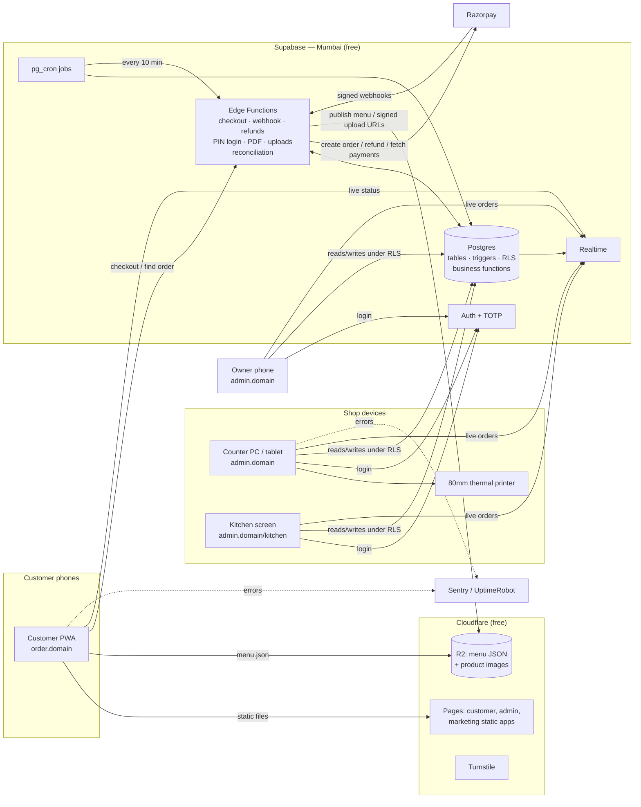
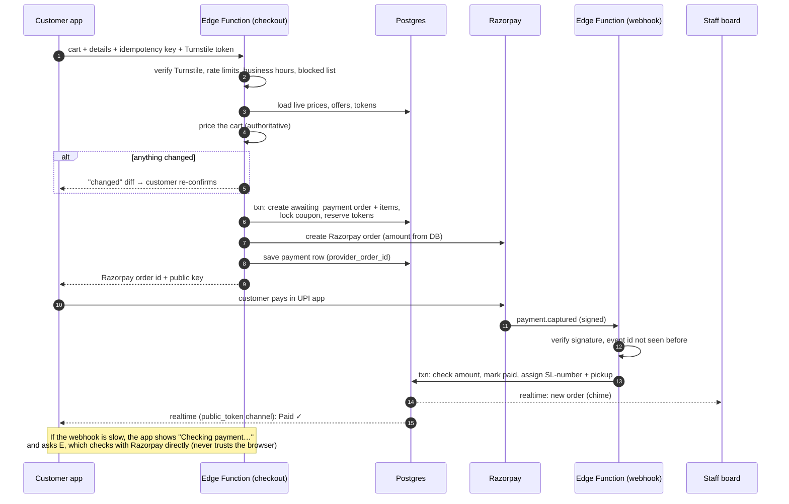

# The Slush Bar — Phase 5: System Architecture

**Status:** ✅ Approved by owner 2026-09-21 · **Date:** 2026-09-21 · Builds on Phases [1](PHASE-1-REQUIREMENTS.md)–[4](PHASE-4-DATABASE.md)

> **Amended 2026-09-22 — the token scheme changed.** On the owner's instruction, redeemable reward
> tokens were replaced by the **Lucky Draw**: a mobile number's spending (excluding GST) adds up across
> every order, and at ₹2,000 it earns **one** numbered token (`SLB-001`…`SLB-500`) that is a draw entry,
> never spent. Anything below about earning, approving, redeeming, expiring or owing tokens is
> **superseded** by “Lucky Draw tokens” in [REQUIREMENTS.md](REQUIREMENTS.md); the rest of this
> document still stands. What was actually built is in
> [IMPLEMENTATION-NOTES.md](IMPLEMENTATION-NOTES.md).


---

## 1. The constraints that decide the stack
| Constraint (from your answers) | What it rules in / out |
|---|---|
| **Under ₹500/month**, free tiers to start | Rules out Vercel: its free plan **forbids commercial use** and Pro is ~₹1,700/month. Rules out a managed Postgres with backups on day one (~₹2,100/month) |
| **Non-technical owner** | Everything managed from Admin; no servers to patch; automatic deploys |
| **Razorpay UPI with webhooks** | The webhook endpoint must be always on (no "sleeping" free servers like Render) |
| **Real-time staff screens & tracker** | Needs a realtime service, not polling a server we pay for |
| **Fraud-proof (Phase 4 R2)** | Money and token rules should live **inside the database** (transactions, locks, triggers), not only in app code |
| **Admin independent from the customer menu** (your rule 23.9) | Separate apps on separate subdomains |
| **Mobile Lighthouse ≥ 90 on 4G** | Customer menu must be a small static app with a cached menu file |
| **Customers in Bahadurgarh** | Database in **Mumbai**, CDN with Indian edge locations |

## 2. Recommended stack
| Layer | Choice | Why this over the alternatives | Cost |
|---|---|---|---|
| **Customer app** (`order.<domain>`) | **React + TypeScript + Vite**, installable PWA, Tailwind CSS | Small, fast static app; the menu is one cached file (O3), so no server rendering is needed. Next.js would mainly add server costs we don't need | ₹0 |
| **Admin app** (`admin.<domain>`) | **React + TypeScript + Vite**, Tailwind, a separate build and subdomain | Fully separate from the customer app: different code bundle, different cookies, and nothing about admin ships to customers' phones | ₹0 |
| **Marketing site** (`<domain>`) | **Astro** (static HTML) | Best-possible SEO and speed for the poster-style page; zero JavaScript by default | ₹0 |
| **Hosting / CDN** | **Cloudflare Pages** | Free plan allows commercial use, unlimited bandwidth, Indian edge locations, free SSL | ₹0 |
| **Database** | **Supabase Postgres**, Mumbai region | Real Postgres (everything in Phase 4 works as designed), plus built-in realtime, auth, row-level security and scheduled jobs in one free project | ₹0 (free tier) |
| **Business logic** | **Postgres functions** for money/token/status rules + **Supabase Edge Functions** (TypeScript) for Razorpay, PDFs, PIN login, uploads | Rules enforced where the data lives; transactions and row locks come naturally; Edge Functions are always on for webhooks | ₹0 (500k calls/month free) |
| **Realtime** | **Supabase Realtime** | Live staff board, kitchen screen and customer tracker without refreshing | ₹0 |
| **Staff auth** | **Supabase Auth** (Owner/Manager: email + password, **TOTP 2FA**); PIN login via an Edge Function that issues the same kind of signed session | One session format everywhere, so row-level security applies to every staff member equally | ₹0 |
| **Images & menu file** | **Cloudflare R2** | 10 GB free, **no bandwidth charges**. Images are resized to WebP in the browser before upload | ₹0 |
| **Bot protection** | **Cloudflare Turnstile** (invisible) on checkout and "find my order" | Stops scripted spam without puzzles for real customers | ₹0 |
| **Maps (delivery pin)** | **MapLibre + OpenFreeMap tiles** | Free; Google Maps would bill per load | ₹0 |
| **Payments** | **Razorpay** Standard Checkout (UPI intent + collect + QR), webhooks, Refunds API, Payments API for reconciliation | Your choice; mature in India | Razorpay's per-transaction fee |
| **Error monitoring** | **Sentry** free | Alerts when something breaks | ₹0 |
| **Uptime check** | **UptimeRobot** free, pinging a health endpoint | Emails you if the site goes down | ₹0 |
| **Email** (password reset, alerts) | **Resend** free (3,000/month) | Supabase's built-in email is heavily rate-limited | ₹0 |
| **Code & deploys** | **GitHub** + GitHub Actions | Tests run on every change; deploys are automatic | ₹0 |
| **Domain** | e.g. `theslushbar.in`, DNS on Cloudflare | | ~₹700–1,000 / **year** |

**Monthly running cost at launch: ₹0** + domain (~₹80/month) + Razorpay fees. That's inside the ₹500 budget.

### Upgrade triggers (tell the owner when they happen)
| Trigger | Upgrade | Cost |
|---|---|---|
| Database passes ~400 MB (expected in year 2), **or** you want managed point-in-time backups | Supabase Pro | ~$25 (~₹2,100) / month |
| Edge Function calls near 500k/month (~1,500+ orders/day) | Supabase Pro (included) | same |
| SMS OTP goes live (Phase 2) | MSG91 / 2Factor + one-time DLT registration | ~₹0.15–0.25 per SMS |

---

## 3. Architecture diagram



### Who talks to what, and why
- **Customers never talk to the database directly.** Everything goes through Edge Functions (checkout, find-order), except the read-only live tracker channel, which is named by the unguessable `public_token`.
- **Staff apps talk to the database directly, but only through row-level security (RLS) and approved functions.** RLS is a set of database rules that check each staff member's role on every read and write. A cashier's session physically cannot read settings or approve a refund, even if someone edits the app in the browser.
- **Razorpay secrets live only in Edge Function environment variables.** The browser only ever sees the public Razorpay key id.

---

## 4. Key flows through the architecture

### 4.1 Checkout and payment


### 4.2 Menu publishing (why a QR scan costs zero database reads)
Manager saves a menu change → a Postgres function bumps `menu_version` → an Edge Function builds `menu/v{n}.json` and uploads it to R2 (cached forever) plus a small `menu/latest.json` pointer (cached 30 s). Phones load the pointer, then the versioned file. If a phone has a slightly old menu, checkout re-pricing catches it (FR-14).

### 4.3 Scheduled jobs
| Job | Where | Every |
|---|---|---|
| Expire unpaid checkouts, release tokens/coupons | pg_cron (SQL) | 5 min |
| Razorpay reconciliation (last 2 h) | pg_cron → Edge Function | 10 min |
| Fraud pattern rules | pg_cron (SQL) | 10 min |
| Full-day reconciliation, daily sales rollup, token expiry, hash-chain check, housekeeping | pg_cron | Nightly 3 AM IST |
| Encrypted database backup → R2 (kept 30 days) | GitHub Actions | Nightly |
| Keep-alive (free projects pause after 7 idle days, e.g. during a holiday closure) | UptimeRobot health ping | 5 min |

### 4.4 Printing
- **Counter PC:** Chrome opened in **kiosk printing mode** with the 80 mm printer set as default. Receipts and kitchen tickets (KOTs) print **silently** with one tap (receipt HTML designed for 80 mm paper).
- **Tablet at the counter:** print through the same network printer from the PC, or tap "Print" which sends the job to the counter PC's queue.
- **Printer recommendation:** an **80 mm thermal printer with USB + Ethernet (LAN)**, e.g. **TVS RP 3230 / RP 3160 Gold** (budget, widely serviced in India) or **Epson TM-T82X** (premium). Check current prices locally before buying.

### 4.5 Real-time updates
- **Staff:** subscribe to order changes for their branch. Kitchen gets only `order_id + status` and then reads the items it's allowed to see (O5/O9).
- **Customer tracker:** subscribes to a broadcast channel named by `public_token`. It also re-checks every 20 s as a fallback for flaky connections.

---

## 5. Code organisation (one repository)
```
slush-bar/
├─ apps/
│  ├─ customer/      React + Vite PWA   → order.<domain>
│  ├─ admin/         React + Vite       → admin.<domain>
│  └─ site/          Astro              → <domain>
├─ packages/
│  ├─ ui/            Design system from the poster (tokens, buttons, sheets, cards)
│  ├─ core/          Shared types, validation schemas, pricing engine, money helpers
│  └─ config/        Lint / TypeScript / Tailwind presets
├─ supabase/
│  ├─ migrations/    SQL: tables, constraints, triggers, RLS, functions (versioned)
│  ├─ functions/     Edge Functions (checkout, razorpay-webhook, refunds, pin-login, pdf, uploads, reconcile)
│  ├─ seed/          Demo menu for development/staging
│  └─ tests/         Database tests (RLS, transitions, token maths, fraud rules)
├─ .github/workflows CI: typecheck, lint, tests, deploy, nightly backup
└─ docs/             These phase documents
```
The **pricing engine lives in `packages/core`**. The customer app uses it for the live preview, and the checkout Edge Function uses **the same code** as the authority. Preview and final price never disagree, but only the server's answer counts.

## 6. Environments
| Env | Purpose | Payments |
|---|---|---|
| **Local** | Development (Supabase runs locally) | Razorpay test |
| **Staging** (`staging.*`, a second free Supabase project) | You click through each milestone here | Razorpay **test** mode |
| **Production** | Real customers | Razorpay **live**, switched on only at M6 after the test pass |

Database changes ship only as versioned migration files, run automatically by CI, first on staging, then production.

## 7. Backups & recovery
- **Nightly** encrypted database dump → R2, kept 30 days.
- **Monthly** automated restore test into a scratch database, verifying the row counts and hash chain.
- **Recovery targets:** lose at most **24 h** of data in the worst case on the free tier. Razorpay's own records plus reconciliation can re-create paid orders from that window. Supabase Pro would reduce the loss window to minutes.
- **Code:** GitHub. **Images:** R2 (versioned uploads).

## 8. What happens when something fails
| Failure | Customer sees | Staff sees |
|---|---|---|
| Razorpay down | "Payments unavailable, please order at the counter" | Banner on the board |
| Supabase down | Menu still loads (it's on R2); checkout shows "please order at counter" | Board shows "Offline, reconnecting" with the last known orders |
| Shop internet down | — | Staff switch to phone hotspot; board resumes automatically. Orders taken manually meanwhile are outside the system (QR-only scope) |
| Webhook delayed | "Checking payment…" then confirmed via a direct Razorpay check | Order appears when confirmed |
| Printer offline | — | "Print failed, retry" toast; receipt always available as PDF |

---

## 9. Decisions (all approved 2026-09-21)
- **A1 Replace Next.js with React + Vite apps + Astro.** Vercel's free plan can't legally be used for a business, and we don't need server rendering. The previous "Next.js" choice was marked provisional.
- **A2 Supabase (Mumbai) as the backend**, with money and token rules enforced inside Postgres, plus Edge Functions for Razorpay.
- **A3 Cloudflare Pages + R2** for hosting, images and the menu file.
- **A4 Three subdomains:** `<domain>` (marketing), `order.<domain>` (customers; the QR codes point here), `admin.<domain>` (staff).
- **A5 Delivery radius is straight-line distance** from the shop (not road distance), with a free OpenStreetMap-based map. Road distance would need a paid maps API.
- **A6 Printing from the counter PC** in silent kiosk mode; buy an **80 mm USB + LAN** printer.
- **A7 Backups:** nightly to R2 on the free tier (worst case 24 h loss), and move to Supabase Pro when the database passes 400 MB or when you want minute-level backups.
- **A8 Invisible bot check** (Turnstile) on checkout and "find my order".
- **A9 Staging + production.** Every milestone is reviewed on staging with Razorpay in test mode.
- **A10 Launch budget: ₹0/month + domain + Razorpay fees**, with the upgrade triggers above.
